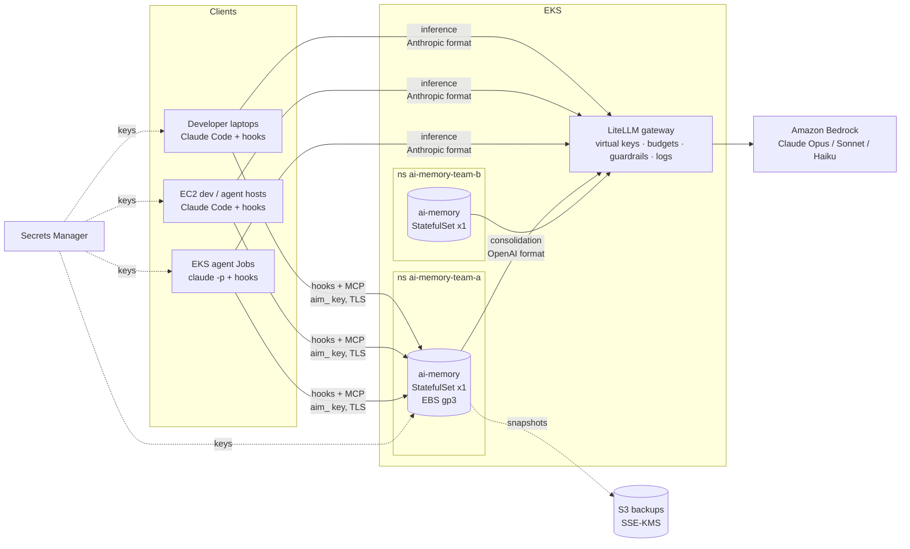

# Shared AI memory behind the LiteLLM gateway

Reference architecture for using [ai-memory](https://github.com/akitaonrails/ai-memory)
(v2.2.1) with Claude on Amazon Bedrock, where **all** model traffic must
go through a shared LiteLLM gateway.

## 1. Constraints

| Constraint | How the design meets it |
|---|---|
| No direct provider access | Claude Code and the ai-memory server both call LiteLLM only. NetworkPolicy blocks all other egress from ai-memory. |
| Claude via Bedrock only | LiteLLM holds the Bedrock access (Pod Identity); clients never see AWS credentials for Bedrock. |
| Per-person attribution | LiteLLM virtual key per developer (spend, budgets, audit) and an ai-memory `aim_` key per developer (every write is attributed). |
| Code runs on EC2, EKS and laptops | Memory is keyed by **repository** (`.ai-memory.toml`), not by where code runs, so any client that can reach the server shares the same project memory. |
| Tight data-handling rules | Opt-in capture (`--capture-mode allowlist`), client-side path exclusions, server-side secret redaction, optional `--no-capture-prompts`, and internal-only endpoints. |

## 2. Topology

Two independent traffic planes:

1. **Inference plane**: Claude Code → LiteLLM `/v1/messages` → Bedrock.
   Configured by a centrally distributed `managed-settings.json`
   (`ANTHROPIC_BASE_URL` + `apiKeyHelper`).
2. **Memory plane**: Claude Code hooks (capture) and MCP tools (recall) →
   tenant ai-memory server. The server calls LiteLLM only when it compiles
   session transcripts into wiki pages (and, optionally, for embeddings).

ai-memory works with **zero LLM calls**: capture, full-text search and
handoffs all work without an LLM. The LLM adds session consolidation and
semantic search, so it can be enabled later per tenant.

## 3. Tenancy model

| Level | Maps to | Rule |
|---|---|---|
| **ai-memory instance** | Trust boundary: a team, group of teams or data classification | Anyone with a key to an instance can read every project in it (no per-project ACL yet, upstream design #708). Separate instances are the isolation boundary. |
| **Workspace** | Domain inside the instance (`billing`, `search`) | Declared in each repo's `.ai-memory.toml`; keep a catalogue. |
| **Project** | One repository | `project = "<canonical repo name>"` in the marker, or `project_strategy = "repo-root"`. Never rely on the checkout folder name. |
| **`_global` scope** | Engineering standards shared by the instance | Written by the instance maintainers; returned alongside project hits in every default query. |

Cross-repo knowledge inside one instance: `memory_query` with `scopes`
(explicit list of projects) or `global=true` (all projects in the instance).

Handoffs and live sessions are **owner-private**. Pages are **shared** by
design: the point of the system is that one person's findings help the
next person.

## 4. Where each client runs

| Client | Gateway config | Memory config | Secret source |
|---|---|---|---|
| Laptop | Distributed `managed-settings.json` | `clients/setup-developer.sh` | SSO → Secrets Manager |
| EC2 host | `deploy/ec2/user-data.sh` writes `/etc/claude-code/managed-settings.json` | same script, with a host-owned API key | Instance role → Secrets Manager |
| EKS agent pod | env vars in the Job | `install-hooks` in the container start | Pod Identity → External Secrets |

EKS agent pods talk to ai-memory over the in-cluster Service; everything
else goes through the internal ALB with TLS.

## 5. Security controls

| Layer | Control |
|---|---|
| Network | Internal ALB only, TLS 1.3 policy, `AI_MEMORY_ALLOWED_HOSTS` (DNS rebinding guard), NetworkPolicy ingress = VPC + labelled agent namespaces, egress = LiteLLM + DNS + S3 endpoint. |
| AuthN | Root bearer kept in Secrets Manager (break-glass only). Users and service identities use native `aim_` keys (SHA-256 + pepper at rest; rotation takes effect at once). Web console: password + HttpOnly cookie + CSRF; OIDC available. |
| AuthZ | `/admin/*` is root-only. Per-project grants are **not** implemented yet → one instance per trust boundary. |
| Capture | `--capture-mode allowlist` (unmarked repos emit nothing), `[capture].ignore_paths` dropped **on the client**, optional `--no-capture-prompts`. |
| Redaction | Typed sanitizer before storage: bearer tokens, `sk-…`, GitHub, Slack, Google, Stripe, AWS `AKIA/ASIA`, PEM keys, URL credentials, `*_KEY/TOKEN/SECRET/PASSWORD=`. Extend with `[sanitize].extra_patterns` (internal token formats, customer IDs). |
| LLM egress | Only through LiteLLM → LiteLLM guardrails, logging and budgets apply to memory consolidation too; spend is attributed to the dedicated service key (key tags need LiteLLM Enterprise). |
| Prompt injection | Retrieved memory is treated as untrusted data by the server's MCP instructions; keep Claude Code permission policies strict regardless. |
| Supply chain | Mirror the image, scan, pin by digest; ship the CLI from the internal artifact store. MIT license. |
| Data lifecycle | Git-versioned markdown wiki + SQLite; online backups to S3 (KMS); `purge-project`, `purge-session`, page TTL (`expires_at`), forget sweeps. |

## 6. Credential lifecycle

| Event | Actions |
|---|---|
| Add user | Create LiteLLM user/key in the team → store at `ai-gateway/developers/<u>/litellm`. `ai-memory user add-human` + `ai-memory api-key add` → store at `ai-memory/developers/<u>/api-key`. |
| Rotate | `ai-memory api-key rotate <id>` (old key fails at once) and LiteLLM key regenerate; update the secret. |
| Remove user | `ai-memory user disable <u>` **and** `ai-memory api-key revoke <id>`: disabling a user does **not** invalidate their API keys. Delete the LiteLLM key. |

Automate these steps from your identity provider where possible.
`scripts/bootstrap-keys.sh` shows the calls.

## 7. Capacity and operations

- **One replica per instance**: one server per data directory (single
  SQLite writer). Rolling updates mean seconds of downtime; hook events
  are spooled on the client and retried.
- **Throughput** (upstream benchmark): ~700 writes/s ceiling, 1.4 ms at
  saturation. Block storage (EBS gp3) required: fsync dominates.
  Rule of thumb: split instances along trust boundaries, not for load.
- **Backups**: sidecar runs `ai-memory backup` (SQLite online backup) every
  6 h; a second sidecar syncs to S3. Test restores quarterly with
  `ai-memory restore` on a scratch instance.
- **Upgrades**: pin the digest; major versions auto-archive the data dir
  before migrating. Upgrade one low-risk instance first.
- **Health**: `ai-memory status --json` (counts, spool, dropped events,
  provider health), LiteLLM spend for the ai-memory service key.
- **Cost**: consolidation uses a Haiku-class alias with its own LiteLLM
  budget (`svc-ai-memory` key).

## 8. Known gaps and risks

| Gap | Impact | Mitigation |
|---|---|---|
| No per-project ACL (upstream #708, proposal) | Anyone with a key reads every project in the instance | Instance per trust boundary; revisit when grants ship. |
| Single writer, no HA | Instance outage stops recall; capture is spooled | Fast restart on EBS, backups, clear SLO (it is an assistant, not a system of record). |
| LLM fallback chains are a proposal (#648) | LiteLLM outage stops consolidation only | LiteLLM's own router/fallbacks cover this. |
| Stored memory can contain wrong or malicious text | Agents may act on bad notes | Treat as untrusted; review `_rules/` pages; `memory_lint`; audit log. |
| Gateway must keep up with Claude Code | New Claude Code features can break behind an old LiteLLM | Pin and upgrade LiteLLM on a schedule; follow the gateway compatibility guide. |
| Young project, fast release cadence | Behaviour changes between versions | Pin versions, staged rollout, internal mirror. |

## 9. Suggested adoption path

| Phase | Scope | Exit criteria |
|---|---|---|
| 0. POC (this repo) | Local compose | `scripts/verify.sh` green; sections 5–8 reviewed. |
| 1. First instance | One instance on EKS, a few repos, zero-LLM | Recall is useful; no redaction misses. |
| 2. Enable consolidation | LiteLLM `memory-consolidation` alias | Page quality review, cost per session within budget. |
| 3. Scale out | One instance per trust boundary, automated key lifecycle, distributed settings | Adding a user takes minutes; removal is automated. |
| 4. Optimise | Embeddings, `_global` standards, EKS agent jobs using memory | Less repeated context per session. |

## 10. Findings from the local run

Everything below was found by running this architecture end to end on emulated
AWS ([../aws-local](../aws-local)) against ai-memory 2.2.1, and is already
applied to the manifests here.

| Finding | Consequence for the design |
|---|---|
| Once human users exist, the server **refuses to start** without a root password or `[auth].recovery_token` | `AI_MEMORY_AUTH__RECOVERY_TOKEN` is a required secret, not an optional one. A tenant that skips it survives until its first restart. |
| With human users on a non-loopback bind, the server requires `[auth].secure_cookie=true` | TLS in front is mandatory, not a recommendation. |
| The CLI's page commands (`write-page`, `search`, `read-page`) use root-only `/admin` routes in multi-user mode | People and agents use the MCP tools; only operators use the CLI. Scripts that automate user-level work must speak MCP (`scripts/mcp-call.sh`). |
| Unset, `AI_MEMORY_EMBEDDING_PROVIDER` downloads a ~87 MB model from `huggingface.co` at startup | Set it to `none` until embeddings are routed through the gateway; otherwise a locked-down node fails or egresses unexpectedly. |
| `AI_MEMORY_LLM_HEADERS` only accepts a list (`["a: b"]`), although the docs show a comma-separated form | Wrong syntax = crash loop at startup. |
| `ai-memory backup` asks the running server (`POST /admin/backup`, root-only) and writes the tarball itself | The backup sidecar needs the root token and its own mount; it also has to wait for the server to be listening. |
| `install-hooks --as-user` is rejected whenever the token is persisted to disk (upstream bug in 2.2.1) | Attribution comes from the API key's owner; `--as-user` is only a label, so it is not used. |
| LiteLLM key **tags** are an Enterprise feature | Attribute memory spend with a dedicated service key and alias instead. |
| A StatefulSet will not replace a crash-looping pod on its own | Roll out config changes with a pod delete, or tenants get stuck on a bad revision. |

Emulation-only caveats (not production risks) are listed in
[../aws-local/README.md](../aws-local/README.md).
